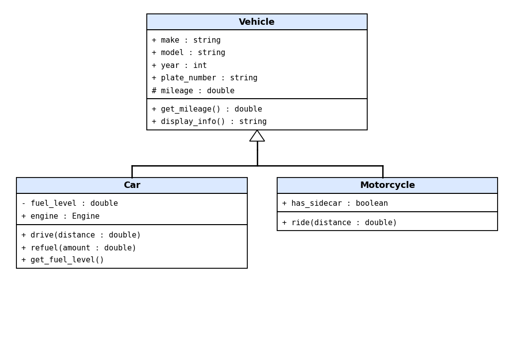
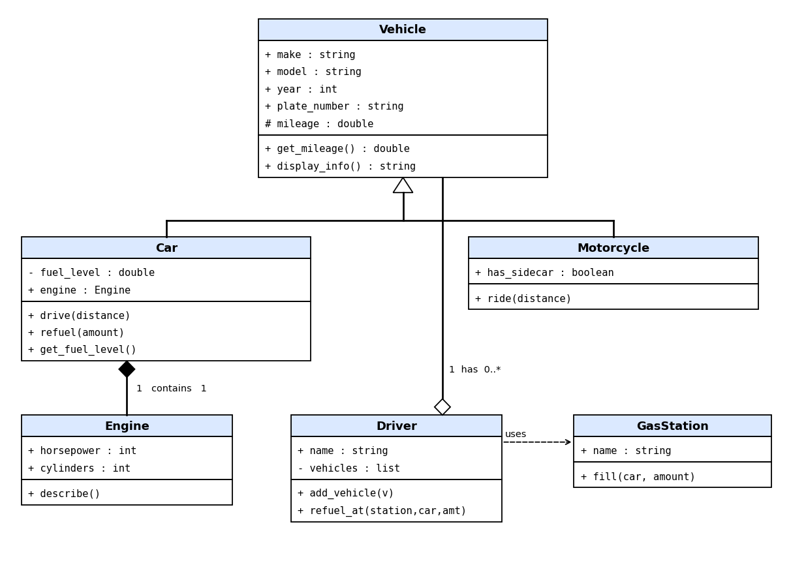
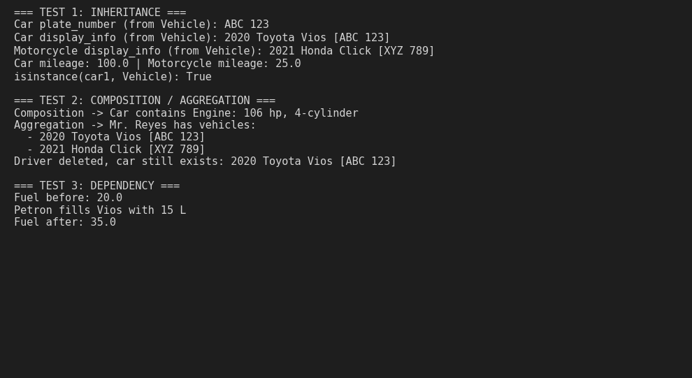
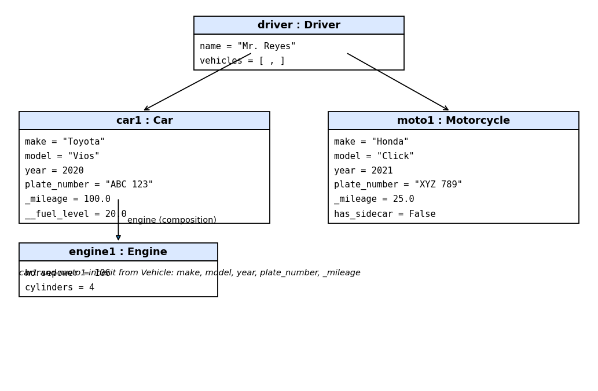

# Advanced Class Relationships 
## Previous Activities 
[classAttrib](classAttributesMethods.md) [classRel](classRelationships.md) 
## Existing System Description:
My system has a Car class and a Driver class that owns a list of cars. The limitation was that Car only covered one kind of vehicle, so adding something like a motorcycle would mean copying make, model, year, plate and mileage code. Also, the engine was not modeled, and refueling at a station was not modeled.
## Inheritance Relationship 
Parent: Vehicle 
Child: Car (also Motorcycle) 
Explanation: A car is a type of vehicle. Vehicle holds shared data (make, model, year, plate_number, mileage) and shared methods (get_mileage, display_info). Car and Motorcycle add only what is specific to them. 
## Inheritance UML 
 
## Composition/Aggregation 
Relationship: Composition between Car and Engine 
Explanation: Aggregation between Driver and Vehicle. Explanation: Car creates its own Engine inside __init__, so the engine is part of that car and does not exist on its own in my system. A Driver receives vehicles that already exist, and they keep existing if the driver is removed. 
## Advanced UML Diagram 
 ## Python Implementation 
[Source Code](advancedRelationships.py) ## Test Run 
 
## Object Diagram 

## Reflection 
Answers:
1. Why did you choose your inheritance relationship?
 A Car is a kind of Vehicle, so Car IS-A Vehicle is true. Every vehicle has a make, model, year, plate number and mileage, so these belong in a parent class. Car adds fuel and an engine, and Motorcycle adds a sidecar flag, which are specific details.
2. How did inheritance reduce duplicate code?
make, model, year, plate_number, _mileage, get_mileage() and display_info() are written once in Vehicle. Both Car and Motorcycle get them by calling super().__init__(). In the test, car1.display_info() and moto1.display_info() both worked without being rewritten in the children.
3. Why is your HAS-A relationship Composition or Aggregation?
Car-Engine is composition because the Car creates Engine(...) itself, and the engine has no purpose outside that car. Driver-Vehicle is aggregation because vehicles are created first and passed in with add_vehicle(). In my test I deleted the driver and the car still existed.
4. What is the difference between Association from Part III and the advanced relationship you implemented?
Association in Part III only said a Driver is connected to Cars. The advanced relationships say more, inheritance says what a class is, composition and aggregation say who owns whom and what happens to the part's lifetime, and dependency says a class only uses another temporarily.
5. How does your design follow the DRY principle?
Shared vehicle data and methods are written once in Vehicle instead of in each child. If I need to change how display_info() works, I edit it in one place and both Car and Motorcycle are updated. Adding another vehicle type only needs its own extra attributes.

