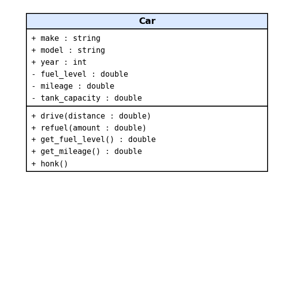
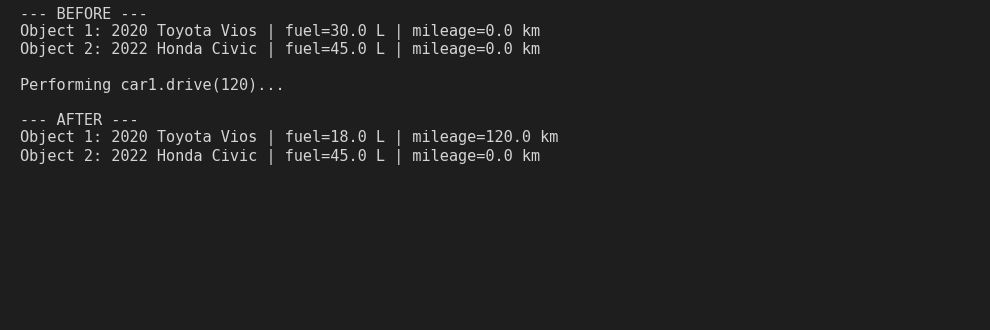
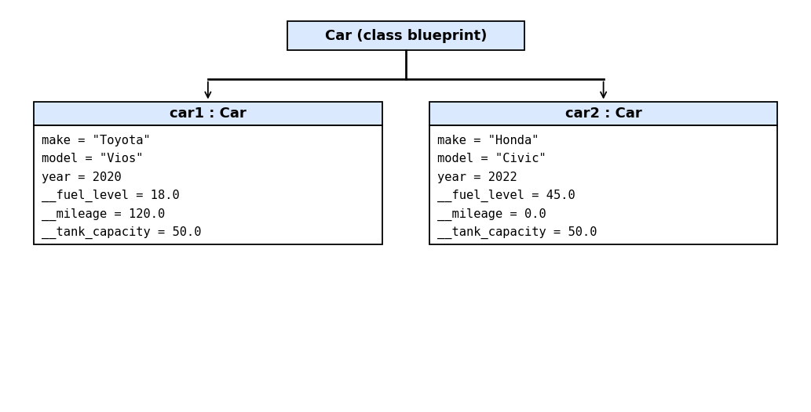

# Class Attributes and Methods 
## Previous Design 
Link to my previous activity: 
[classObjectUML.md](classObjectUML.md) 
## Design Revision 
Changes from my previous design:
- Renamed fuellevel to fuel_level and getfuellevel() to get_fuel_level() to follow Python naming style.
- Added a private mileage attribute so drive() can actually track distance travelled.
- Added a private tank_capacity so refuel() can enforce the "up to its tank capacity" rule from my original description.
- Added get_mileage() so the private mileage can be read safely.
## Visibility Decisions 
| Attribute | Data Type | Visibility | Reason | 
|---|---|---|---| 
|make|string| Public|Identifying info that is safe to read anywhere.| 
|model | string| Public |Identifying info that is safe to read anywhere.| 
|year |	int |Public |Identifying info that is safe to read anywhere. |
|fuel_level | double| Private| Must only change through drive() and refuel() so it can never go negative or exceed the tank. |
|mileage|double|private|An odometer should only go up through drive(), never be set freely.|
|tank_capacity|double|private|Fixed internal limit used by refuel().|
## Updated UML Class Diagram 
 
## Python Implementation
[View Python Source](classImplementation.py) 
## Test Run 
 
## Object Diagram 
 
## Analysis 
### Why did you make your chosen attribute private?
I made fuel_level private because the whole behaviour of the car depends on it. If any part of the program could write car.fuel_level = -50 or = 9999, the car could have negative fuel or hold more than its tank allows, and drive() would give nonsense results. Keeping it private forces every change to go through drive() and refuel(), which check the rules first.
### Which method changes the state of your object?
drive(distance) changes the object. It subtracts distance/10 liters from the private __fuel_level and adds the distance to the private __mileage. In my test, car1.drive(120) lowered its fuel from 30.0 L to 18.0 L and raised its mileage from 0 to 120 km. If there is not enough fuel, nothing changes.
### How did your two objects demonstrate that instances are independent? ### What is the difference between your class diagram and your object diagram?
car1 (Toyota Vios) and car2 (Honda Civic) both come from the Car class but started with different values. After I called drive(120) on car1 only, its fuel dropped to 18.0 L and its mileage became 120 km. car2 still showed 45.0 L and 0 km, so each object keeps its own copy of the data.
### What is the difference between your class diagram and your object diagram?
The class diagram shows the blueprint of Car, attribute names, types, visibility and methods, with no real values. The object diagram shows actual cars like car1 with make "Toyota", fuel 18.0 and mileage 120.0, and car2 with its own different values. One class diagram can produce many object diagrams.
