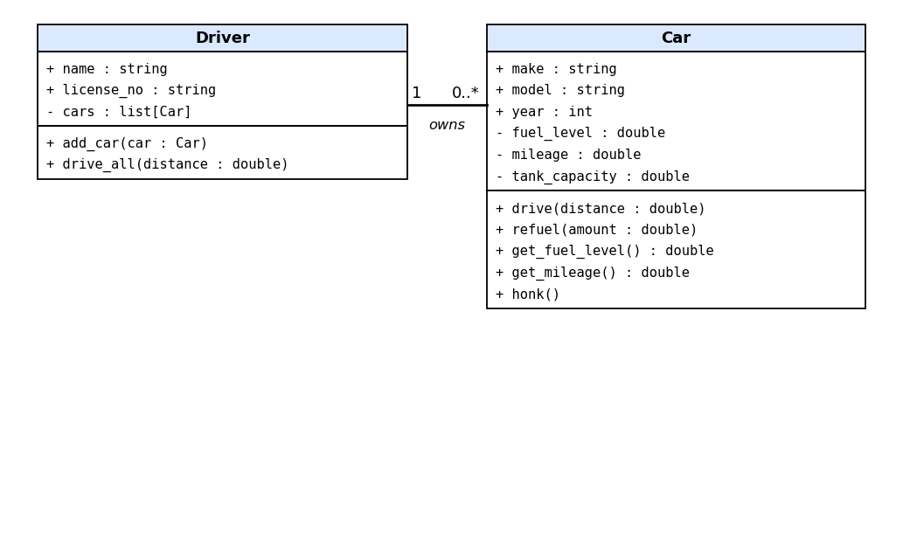
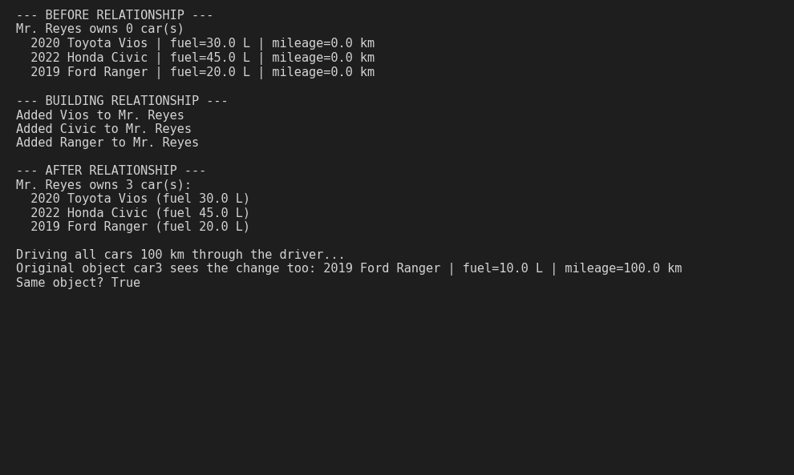
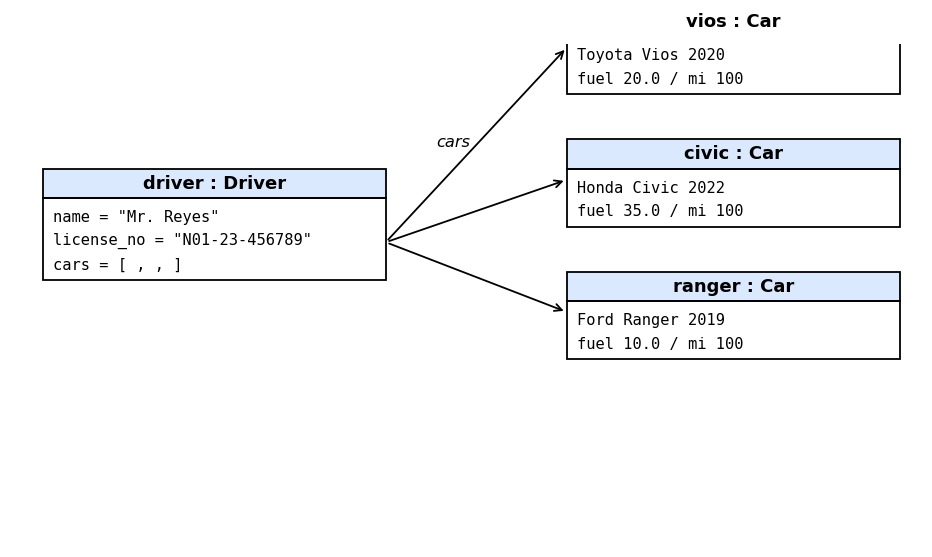

# Class Relationships: Association and Multiplicity 
## Previous Work 
[Part I - Classes and Objects](classObjectUML.md) 
[Part II - Class Attributes and Methods](classAttributesMethods.md) 
## Existing Class 
Class: Car Description 
Description: Represents a vehicle with make, model, year, and private fuel and mileage that change when it is driven or refueled.
## New Related Class 
Class: Driver Description
Description: Represents a person who owns and drives cars. It has a name, a license number, and a list of the cars they own. 
## Association 
Relationship: Driver owns Car 
Explanation: A car system makes sense with someone using the cars. Connecting them lets a driver keep track of all their cars and drive them through the driver object. 
## Multiplicity
Multiplicity: 1 Driver to 0..* Cars 
Explanation: One driver can own no cars yet, one car, or many cars, so the "many" side is 0..*. In this model each car belongs to one driver, so the driver side is 1. 
## UML Class Relationship Diagram 
 
## Python Implementation 
[View Python Source](classRelationships.py) 
## Test Run 
 
## Object Relationship Diagram 
 
## Analysis 
### What is the association between your two classes?
A Driver owns Car objects. In my system, Mr. Reyes is a Driver who owns a Vios, a Civic and a Ranger. The Driver can use these cars through its own methods, like drive_all().
### What multiplicity did you choose and why?
I chose one-to-many (1 to 0..*). A driver may start with zero cars and later own several, while each car has one owner in this system. A one to one link would limit a driver to a single car.
### How did you implement the relationship in Python?
The Driver class has an attribute self.cars = [] that stores Car objects. The method add_car(car) appends the car object to this list. I created three Car objects and added each one to driver.
### Why did you store an object reference instead of copying its data?
If I stored only car.model, the driver would just hold a string and could not drive the car or read its fuel. By storing the actual Car, driver.cars[2] and car3 are the same object (is returned True). When the driver drove all cars, car3's fuel changed too.
### If your relationship uses many, why is a list appropriate?
A list can hold any number of items and keeps their order, which fits a driver whose number of cars changes. The list contains full Car objects, not names or numbers. I can loop through it with for car in driver.cars and call each car's methods.

